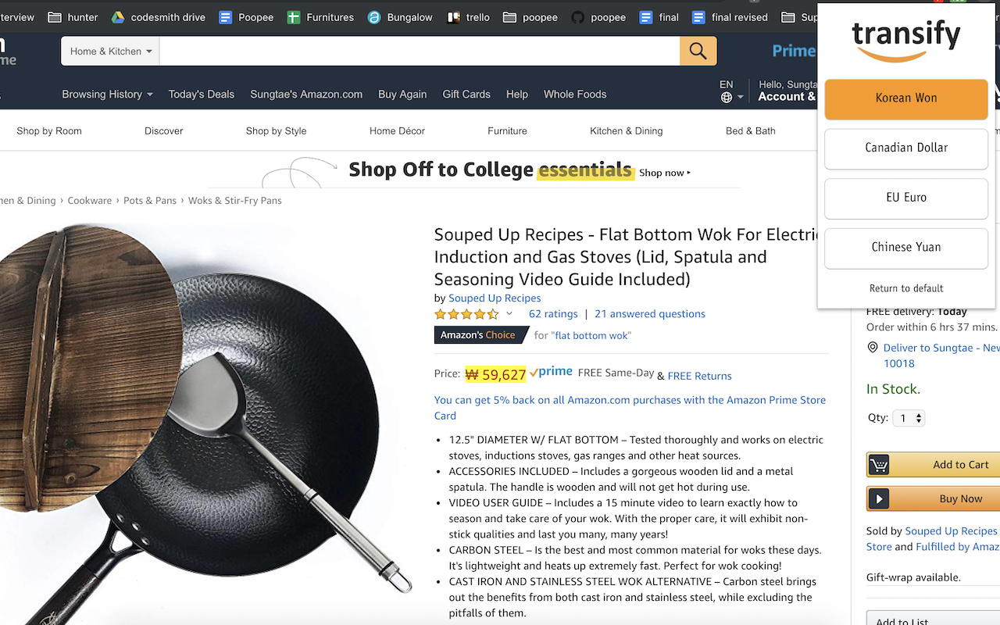

# Transify

<!--  -->

  

Transify is a Chrome extension for converting USD prices to local currencies on Amazon.com. Transify currently supports the following currency conversion: KRW, CAD, EUR, and CNY.

## How to use Transify in local environment

1. Direct to desired directory you want to download the chrome extension
2. `git clone https://github.com/joshua0308/transify.git via terminal command`
3. Open google chrome and go to manage extensions page
4. Select 'Load Unpacked' on left top corner
5. Select the Transify folder that you downloaded
6. You should be now seeing Transify added on your extension list
7. Enjoy shopping in amazon.com with ease of Transify!

## Authors

- **Josh Kim** - [@joshua0308](https://github.com/joshua0308)
- **Bryan Lee** - [@mylee1995](https://github.com/mylee1995)
